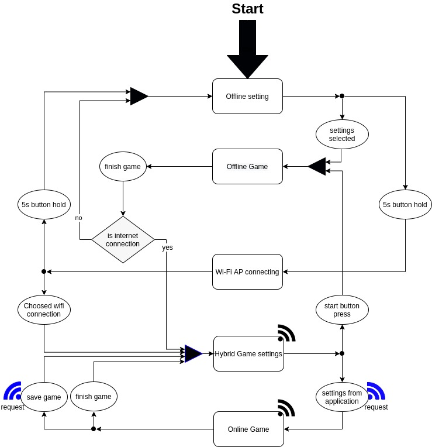

# DartPlus - own constructed dart board.
Project idea was inspirated by Ricardo's Alves [open-darts](https://create.arduino.cc/projecthub/ricardo-alves/opendarts-homemade-dartboard-machine-2a2914).

# DartPlus Team
- [Jakub Delicat (@delipl)](https://github.com/delipl) - Embedded programmer C++ and Project Architect 
- [Bartosz Kwiatkowski (@xHeler)](https://github.com/xHeler) - Frontend, Backend and Database programmer
- [Artur Ziółkowski (@ArturZiolkowski1999)](https://github.com/ArturZiolkowski1999) - Embedded and Frontend programmer

Contributors:
- [Eryk Możdżeń (@Eryk-Mozdzen)](https://github.com/Eryk-Mozdzen) - Hardware consultant

## Hardware
### Arduino
Arduino is connected to the dartboard button matrix. It sends information about obtained points via UART communication protocol to Esp.
### Esp - wifi module
Esp is the main micro controller in the device. It manages Offline Games and Online Games.
#### Esp states diagram

